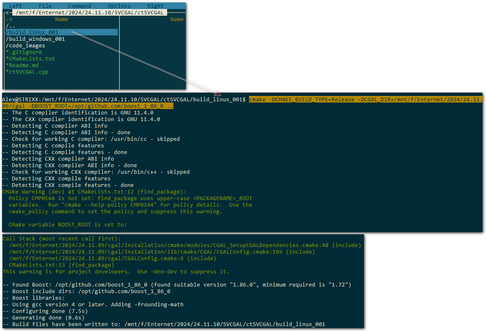
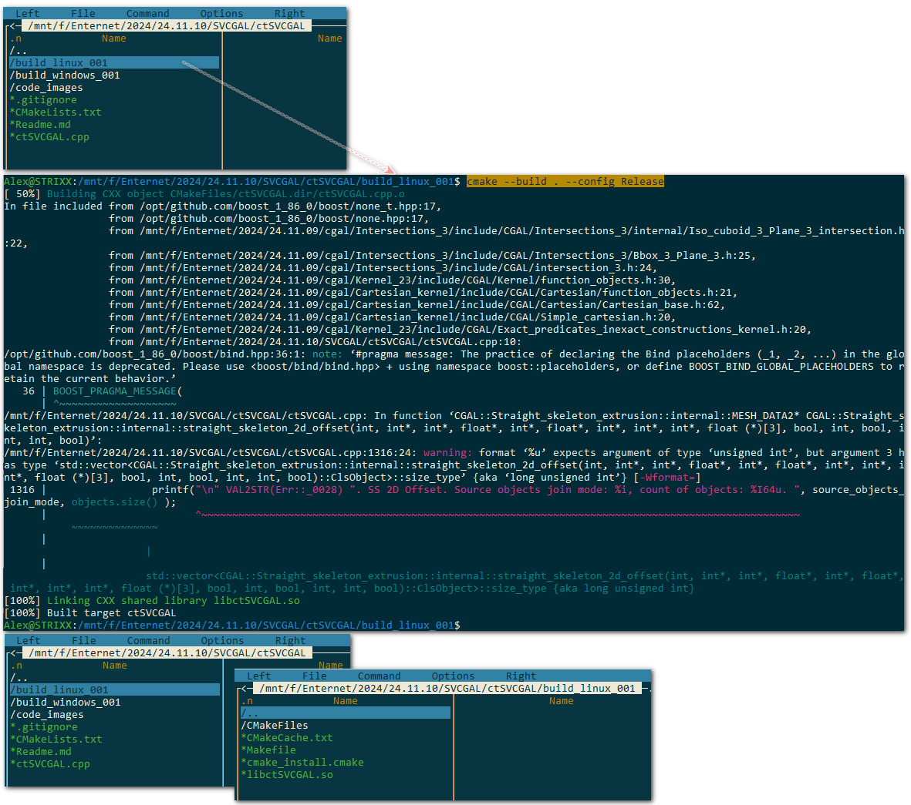

## Description

Binary background for nodes of Sverchok: https://github.com/nortikin/sverchok

- SvStraightSkeleton2DOffset https://nortikin.github.io/sverchok/docs/nodes/CAD/straight_skeleton_2d_offset.html
- SvStraightSkeleton2DExtrude https://nortikin.github.io/sverchok/docs/nodes/CAD/straight_skeleton_2d_extrude.html

## Dependency

- CGAL (https://www.cgal.org/)
- Boost (https://www.boost.org/)

## Build

1. Download CGAL

```
git clone https://github.com/CGAL/cgal.git
git branch -m 6.0.x-branch
```

2. Download and build Boost

Build boost

Windows:

```
bootstrap.bat
b2 link=static
```

Linux:

```
./bootstrap.sh
./b2 cxxflags=-fPIC cflags=-fPIC install --prefix=/opt/github.com/boost_1_86_0/stage
```

### 3. Build ctSVCGAL

#### 3.1. Build Windows

1. open CMakeLists.txt and edit path to Boost stage for windows path
2. mkdir build_windows && cd build_windows

```
3. cmake -DCMAKE_BUILD_TYPE=Release -DCGAL_DIR=F:\Enternet\2024\24.11.09\cgal -DBOOST_ROOT=E:\github.com\boost_1_86_0 ..
4. cmake --build . --config Release
```

#### 3.2. Build Linux

1. open CMakeLists.txt and edit path to Boost stage for linux path
2. mkdir build_linux && cd build_linux
```
3. cmake -DCMAKE_BUILD_TYPE=Release -DCGAL_DIR=/mnt/f/Enternet/2024/24.11.09/cgal -DBOOST_ROOT=/opt/github.com/boost_1_86_0 ..
4. cmake --build . --config Release
```





Copy results .dll and .so into pySVCGAL/src/pySVCGAL/clib/*.*

4. Publish pypi

To do this part goto pySVCGAL readme.