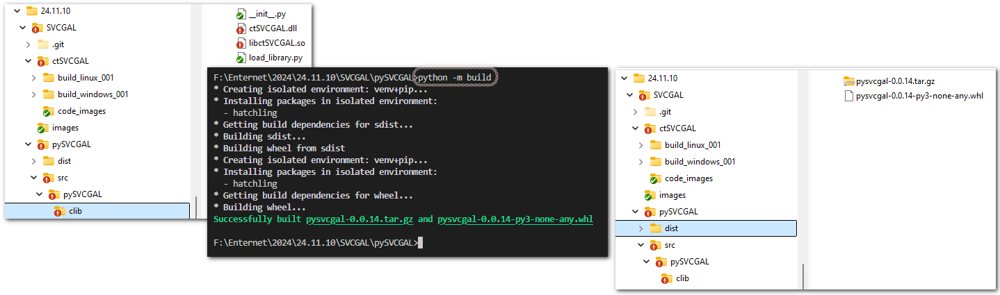

## Description

This is a Python wrapper of ctCGAL. See also:

https://www.cgal.org/2023/05/09/improved_straight_skeleton/

https://pypi.org/project/pySVCGAL/

## Usage

```
pip install pySVCGAL
```

For developer
-------------

for local install from package folder:

```
"E:\install\Blender\blender-3.6.12-windows-x64\3.6\python\Scripts\pip.exe" install .
```
D:\install\Blender\blender-3.6.19-windows-x64\3.6\python\Scripts\pip.exe install .

To uninstall write a name (no some folder name):

```
"E:\install\Blender\blender-3.6.12-windows-x64\3.6\python\Scripts\pip.exe" uninstall pySVCGAL
```
D:\install\Blender\blender-3.6.19-windows-x64\3.6\python\Scripts\pip.exe uninstall pySVCGAL

## Publish/Update package on PyPi

1. Update version of library.

```
2. python -m build
3. twine upload dist/*
```




