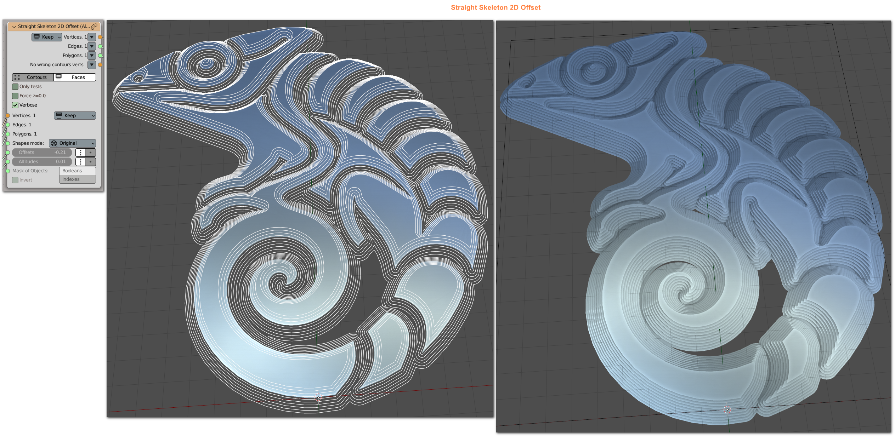
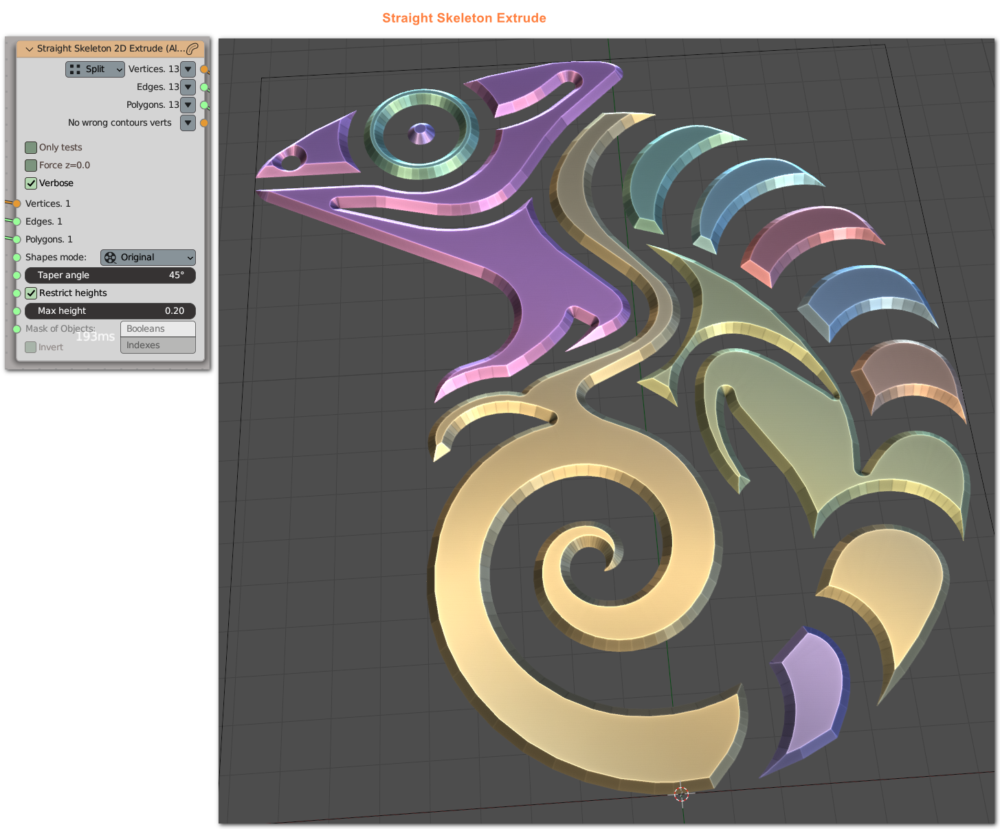

## Description

This is a sverchok C++ library wrapper for some CGAL functions:

Straight Skeleton 2D Extrude
Straight Skeleton 2D Offset

## Build

1. Build ctSVCGAL first
2. Install pySVCGAL

See:

https://nortikin.github.io/sverchok/docs/nodes/CAD/stright_skeleton_2d_extrude.html

https://nortikin.github.io/sverchok/docs/nodes/CAD/stright_skeleton_2d_offset.html